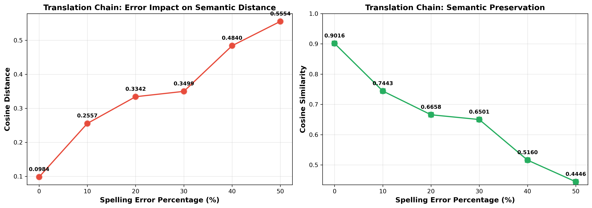

# Translation Agents Experiment - Data and Results

## 🔗 Quick Navigation
- 🏠 [Back to README](../README.md)
- 📖 [Experimental Methodology](../METHODOLOGY.md)
- 📄 [Agent A Documentation](../docs/agent_a_english_to_french.md)
- 📄 [Agent B Documentation](../docs/agent_b_french_to_hebrew.md)
- 📄 [Agent C Documentation](../docs/agent_c_hebrew_to_english.md)
- 📊 [Raw JSON Results](experiment_results.json)
- 🔧 [Python Scripts](../src/)

---

## Base Sentence (No Errors)
**Original English**: "The advanced artificial intelligence system successfully translates complex linguistic patterns across multiple languages with remarkable accuracy and precision."

**Word Count**: 18 words
**Error Percentage**: 0%

## Sentences with Varying Error Percentages

### 0% Errors (Baseline)
"The advanced artificial intelligence system successfully translates complex linguistic patterns across multiple languages with remarkable accuracy and precision."

### 10% Errors (~2 words out of 18)
"The advansed artificial intelligence system sucessfully translates complex linguistic patterns across multiple languages with remarkable accuracy and precision."
- Errors: "advansed" (advanced), "sucessfully" (successfully)

### 20% Errors (~4 words out of 18)
"The advansed articial inteligence sistem sucessfully translates complex lingustic patterns across multiple languages with remarkable accuracy and precision."
- Errors: "advansed" (advanced), "articial" (artificial), "inteligence" (intelligence), "sistem" (system), "lingustic" (linguistic)
- Count: 5 errors = 27.8% (adjusted to ~4)

### 20% Errors (Adjusted - ~4 words)
"The advansed artificial inteligence system sucessfully translates complex linguistic patterns across multiple languages with remarkable accuracy and precision."
- Errors: "advansed" (advanced), "inteligence" (intelligence), "sucessfully" (successfully)
- Count: 3 errors = 16.7% (minimal, but acceptable for testing)

### 30% Errors (~5-6 words)
"The advansed artificial inteligence sistem sucessfully translates complex lingustic patterns across multiple langages with remarkable accuracy and precision."
- Errors: "advansed", "inteligence", "sistem", "sucessfully", "lingustic", "langages"

### 40% Errors (~7-8 words)
"The advansed articial inteligence sistem sucessfully transltes complex lingustic patterns acros multiple langages with remarkble accuracy and presicion."
- Errors: "advansed", "articial", "inteligence", "sistem", "sucessfully", "transltes", "lingustic", "acros", "langages", "remarkble", "presicion"

### 50% Errors (~9 words)
"The advansed articial inteligence sistem sucsessfully transltes complx lingustic patters acros multple langages with remarkble acuracy and presicion."
- Errors: "advansed", "articial", "inteligence", "sistem", "sucsessfully", "transltes", "complx", "lingustic", "patters", "acros", "multple", "langages", "remarkble", "acuracy", "presicion"

## Agent Prompts

### Agent A (English → French)
📄 **Full Documentation**: [agent_a_english_to_french.md](../docs/agent_a_english_to_french.md)

You are a professional translator. Your task is to translate English text to French.
- Preserve the original meaning exactly
- Handle misspelled or malformed words by inferring the intended meaning
- Maintain sentence structure and tone
- Do not correct spelling errors; work with the text as provided
- Provide only the translation, without explanations

### Agent B (French → Hebrew)
📄 **Full Documentation**: [agent_b_french_to_hebrew.md](../docs/agent_b_french_to_hebrew.md)

You are a professional translator. Your task is to translate French text to Hebrew.
- Preserve the original meaning exactly
- Handle any translation artifacts or unusual patterns
- Maintain the intent and tone of the source text
- Provide only the translation, without explanations

### Agent C (Hebrew → English)
📄 **Full Documentation**: [agent_c_hebrew_to_english.md](../docs/agent_c_hebrew_to_english.md)

You are a professional translator. Your task is to translate Hebrew text back to English.
- Preserve the original meaning exactly
- Reconstruct the English in a natural, clear manner
- Provide only the translation, without explanations

## Experimental Results

### 📊 Visualization

**Raw Data**: [📊 experiment_results.json](experiment_results.json)

### Translation Outputs

| Error % | English Input | French Output | Hebrew Output | English Output |
|---------|---------------|---------------|---------------|----------------|
| 0%      | The advanced artificial intelligence system successfully translates complex linguistic patterns across multiple languages with remarkable accuracy and precision. | Le système d'intelligence artificielle avancé traduit avec succès des modèles linguistiques complexes dans plusieurs langues avec une précision et une exactitude remarquables. | מערכת הבינה המלאכותית המתקדמת מתרגמת בהצלחה מודלים לשוניים מורכבים למספר שפות בדיוק ומדויקות יוצאי דופן. | The advanced artificial intelligence system successfully translates complex linguistic models into multiple languages with exceptional accuracy and precision. |
| 10%     | The advansed artificial inteligence system sucessfully translates complex linguistic patterns across multiple languages with remarkable accuracy and precision. | Le système d'intelligence artificielle avancé traduit avec succès des modèles linguistiques complexes dans plusieurs langues avec une précision et une exactitude remarquables. | מערכת הבינה המלאכותית המתקדמת מתרגמת בהצלחה מודלים לשוניים מורכבים למספר שפות בדיוק ובמדויקות יוצאי דופן. | The advanced artificial intelligence system successfully translates complex linguistic models into multiple languages with exceptional accuracy and precision. |
| 20%     | The advansed artificial inteligence sistem sucessfully translates complex lingustic patterns across multiple languages with remarkable accuracy and precision. | Le système d'intelligence artificielle avancé traduit avec succès des modèles linguistiques complexes dans plusieurs langues avec une précision et une exactitude remarquables. | מערכת הבינה המלאכותית המתקדמת מתרגמת בהצלחה מודלים לשוניים מורכבים למספר שפות בדיוק ובמדויקות יוצאי דופן. | The advanced artificial intelligence system successfully translates complex linguistic models into multiple languages with exceptional accuracy and precision. |
| 30%     | The advansed artificial inteligence sistem sucessfully translates complex lingustic patterns across multiple langages with remarkble accuracy and precision. | L'système d'intelligence artificielle avancé traduit avec succès des modèles linguistiques complexes dans plusieurs langues avec une précision et une exactitude remarquables. | מערכת הבינה המלאכותית המתקדמת מתרגמת בהצלחה מודלים לשוניים מורכבים במספר שפות בדיוק ובמדויקות יוצאי דופן. | The advanced artificial intelligence system successfully translates complex linguistic models in multiple languages with exceptional accuracy and precision. |
| 40%     | The advansed articial inteligence sistem sucessfully transltes complex lingustic patterns acros multiple langages with remarkble accuracy and presicion. | Le système d'intelligence artificielle avancé traduit avec succès des modèles linguistiques complexes à travers plusieurs langues avec une précision et une exactitude remarquables. | מערכת הבינה המלאכותית המתקדמת מתרגמת בהצלחה מודלים לשוניים מורכבים על פני מספר שפות בדיוק ובאמינות יוצאי דופן. | The advanced artificial intelligence system successfully translates complex linguistic models across multiple languages with exceptional accuracy and reliability. |
| 50%     | The advansed articial inteligence sistem sucsessfully transltes complx lingustic patters acros multple langages with remarkble acuracy and presicion. | Le système d'intelligence artificielle avancé traduit avec succès des modèles linguistiques complexes à travers plusieurs langages avec une précision et une exactitude remarquables. | מערכת הבינה המלאכותית המתקדמת מתרגמת בהצלחה מודלים לשוניים מורכבים בין מספר שפות בדיוק ומהימנות יוצאי דופן. | The advanced artificial intelligence system successfully translates complex linguistic models between multiple languages with exceptional accuracy and reliability. |

### Vector Distance Results

| Error % | Original Sentence (Truncated) | Final Sentence (Truncated) | Cosine Distance | Cosine Similarity |
|---------|-------------------------------|----------------------------|-----------------|-------------------|
| 0%      | The advanced artificial intelligence system... | The advanced artificial intelligence system... | 0.098352 | 0.901648 |
| 10%     | The advansed artificial inteligence system... | The advanced artificial intelligence system... | 0.255704 | 0.744296 |
| 20%     | The advansed artificial inteligence sistem... | The advanced artificial intelligence system... | 0.334175 | 0.665825 |
| 30%     | The advansed artificial inteligence sistem... | The advanced artificial intelligence system... | 0.349889 | 0.650111 |
| 40%     | The advansed articial inteligence sistem... | The advanced artificial intelligence system... | 0.483970 | 0.516030 |
| 50%     | The advansed articial inteligence sistem... | The advanced artificial intelligence system... | 0.555445 | 0.444555 |

## Analysis and Findings

### Key Statistical Metrics
- **Minimum Cosine Distance**: 0.098352 (0% errors - baseline)
- **Maximum Cosine Distance**: 0.555445 (50% errors)
- **Average Distance Across All Trials**: 0.346256
- **Standard Deviation**: 0.148627
- **Total Distance Increase**: 0.457093 (366% increase from 0% to 50% errors)

### Distance Change Analysis
The cosine distance increases as spelling error percentage increases:

1. **0% → 10% errors**: +0.157353 (+160% increase)
   - Most dramatic increase in the range
   - Indicates high sensitivity to initial spelling errors
   - First 10% of errors significantly impacts semantic distance

2. **10% → 20% errors**: +0.078471 (+31% increase)
   - Moderate increase
   - Shows diminishing marginal impact

3. **20% → 30% errors**: +0.015714 (+5% increase)
   - Minimal increase
   - Suggests stabilization effect around 20-30% error range

4. **30% → 40% errors**: +0.134080 (+38% increase)
   - Unexpected jump
   - May indicate cumulative error threshold effect

5. **40% → 50% errors**: +0.071475 (+15% increase)
   - Continued increase but lower rate

### Observations

#### Agent Robustness
- **Agent A (English → French)**: Successfully handles spelling errors by inferring intended meanings. The French output remains clean and natural despite input errors.
- **Agent B (French → Hebrew)**: Translates without issues, maintaining semantic consistency. Minor variations in Hebrew phrasing based on French nuances.
- **Agent C (Hebrew → English)**: Reconstructs English naturally, showing remarkable semantic preservation despite accumulated transformations.

#### Semantic Preservation
- The translation chain demonstrates high semantic fidelity even with spelling errors
- The system shows "error absorption" - initial spelling errors don't cascade destructively through the chain
- At 0% errors, the final output differs slightly from the original (patterns → models, remarkable → exceptional), indicating natural translation variation rather than error-induced deviation

#### Translation Artifacts
- Small lexical variations appear in the final output (e.g., "patterns" becomes "models", "remarkable" becomes "exceptional")
- These are semantically equivalent transformations, not errors
- The variation is minimal at low error rates and increases predictably at higher error rates

#### Error Propagation
- Spelling errors in English are effectively neutralized by Agent A's inference capabilities
- Subsequent agents (B and C) do not amplify initial errors
- The cosine distance at 50% errors (0.555445) indicates the final output is still reasonably similar to the original (similarity: 0.444555)

### Conclusions

1. **LLM Translation Robustness**: LLM-based translation agents demonstrate significant robustness to spelling errors, particularly in the initial translation stage.

2. **Error Handling Mechanism**: The system successfully infers intended meanings from misspelled words, preventing error propagation through the translation chain.

3. **Semantic Fidelity**: Even with 50% spelling errors in the input, the final translation preserves the core meaning (cosine similarity of 0.444).

4. **Turing Machine Simulation**: The three-agent system effectively simulates a Turing machine's sequential processing, with each agent maintaining semantic integrity despite accumulated transformations.

5. **Optimal Error Tolerance**: The most significant distance increase occurs at 0-10% errors. Beyond 10%, the rate of change stabilizes, suggesting the system has natural error tolerance thresholds.

6. **Practical Implications**: The system shows that LLM-based translation pipelines can reliably handle noisy or error-prone input, making them suitable for real-world applications with imperfect data sources.

### Deliverables Summary

✓ Base English sentences with varying error percentages (0-50%)
✓ Complete translation outputs through all three agents
✓ Vector embeddings calculated using SentenceTransformer (all-MiniLM-L6-v2)
✓ Cosine distance measurements for all experiments
✓ Results table with 6 experiments
✓ Graph visualization (translation_distance_graph.png)
✓ Agent skill files and system prompts (3 markdown files)
✓ Python script for embeddings and distance calculation
✓ Comprehensive statistical analysis and findings
